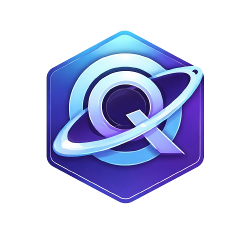

<div align="center">
    <h1> Quantum Language™</h1>


</div>

<p align="center">
  <em>A dynamically-typed scripting language nobody asked for.</em>
</p>

<p align="center">
  <a href="https://github.com/SENODROOM/Quantum-Language">
    
  </a>
  <a href="https://github.com/SENODROOM/Quantum-Language/issues">
    
  </a>
  
  <a href="https://github.com/SENODROOM/Quantum-Language/blob/main/LICENSE">
    
  </a>
</p>

---

## About

Quantum Language™ is a real, working dynamically-typed scripting language built from scratch in **C++17**. It features a lexer, parser, 34-node AST, tree-walk interpreter, REPL, and full OOP support with inheritance, closures, lambdas, list comprehensions, and Python-style slicing.

### What Makes It Different?

Quantum supports **Python syntax, JavaScript syntax, AND C++ syntax simultaneously** — in the same file. Three different ways to declare a function? Why not.

### Features

- ✅ **Multi-syntax support** — Python, JavaScript, and C++ in one file
- ✅ **Full OOP** — Classes, inheritance, encapsulation
- ✅ **Closures & Lambdas** — First-class functions
- ✅ **List Comprehensions** — Python-style
- ✅ **C-style Pointers** — `&var`, `*ptr`, `ptr->member` in a scripting language
- ✅ **Python Slicing** — `list[1:4:2]`
- ✅ **REPL** — Interactive interpreter
- ✅ **Online IDE** — [Try it here](https://senodroom.github.io/Quantum-Language/ide.html)
- ✅ **Documentation** — [Language Reference](https://senodroom.github.io/Quantum-Language/language.html)

---

## File Extension

`.sa`

---

## Quick Start

### Build from Source

```bash
# Clone the repository
git clone https://github.com/SENODROOM/Quantum-Language.git
cd Quantum-Language

# Build (adjust commands for your build system)
make quantum

# Run the interpreter
./quantum hello.sa

# Or enter REPL mode
./quantum
```

### Run Online

Try Quantum Language directly in your browser at the [Online IDE](https://senodroom.github.io/Quantum-Language/ide.html).

---

## Example Code

```python
# This is valid Quantum code
def greet(name) {
    print("Hello, " + name + "!");
}

greet("World");

# Python-style list comprehension
squares = [x * x for x in range(10)];

// C-style pointers
ptr = &value;
```

---

## Documentation

Full language documentation is available at [quantum-language.github.io](https://senodroom.github.io/Quantum-Language/language.html).

---

## Tech Stack

- **Language Implementation:** C++17
- **Website:** HTML5, CSS3, Vanilla JavaScript
- **Interpreter:** Custom tree-walk interpreter

---

## License

MIT License — See [LICENSE](LICENSE) for details.

---

## Author

Built by [Muhammad Saad Amin](https://github.com/SENODROOM) at FAST NUCES.

---

<p align="center">
  <sub>Files end in .sa — We don't know what .sa stands for either.</sub>
</p>
